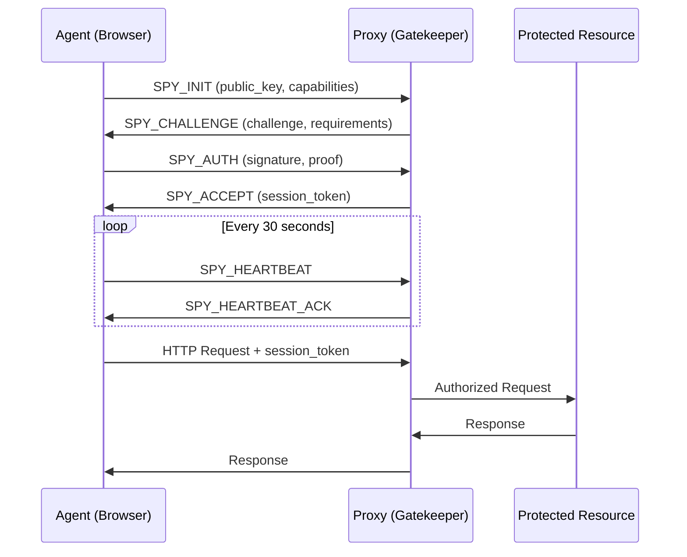

# SPY Protocol Specification v1.0

## Abstract

The SPY (Secure Proxy Authentication) Protocol enables cryptographic authentication between user agents and authenticating proxies to control access to protected resources. This specification defines a lightweight, efficient protocol using elliptic curve cryptography for mutual authentication and session establishment.

## 1. Overview

### 1.1 Purpose
SPY Protocol provides:
- Strong cryptographic authentication without passwords
- Protection against unauthorized agents and bots
- Session management with periodic re-validation
- Minimal overhead for legitimate users
- Enterprise-grade access control

### 1.2 Architecture
```
┌─────────────┐         ┌─────────────┐         ┌──────────────┐
│    Agent    │ <-----> │    Proxy    │ <-----> │  Protected   │
│  (Browser)  │   SPY   │ (Gatekeeper)│  HTTP  │   Resource   │
└─────────────┘         └─────────────┘         └──────────────┘
```

### 1.3 Design Principles
- **Zero-Trust**: Every connection must be authenticated
- **Stateless**: Proxy maintains minimal session state
- **Performance**: Sub-100ms authentication overhead
- **Simplicity**: Clear, implementable protocol
- **Extensibility**: Version negotiation for future enhancements

## 2. Protocol Flow

### 2.1 Initial Handshake

```
Agent (Browser)                Proxy (Gatekeeper)              Protected Resource
     |                              |                                |
     |-------- SPY_INIT ----------->|                                |
     |         (1)                  |                                |
     |<------ SPY_CHALLENGE --------|                                |
     |         (2)                  |                                |
     |-------- SPY_AUTH ----------->|                                |
     |         (3)                  |                                |
     |<------ SPY_ACCEPT -----------|                                |
     |         (4)                  |----------- AUTHORIZED -------->|
     |                              |         (Internal)             |
     |<========= ESTABLISHED CONNECTION =========>|<===============>|
```

### 2.2 Message Definitions

#### 2.2.1 SPY_INIT
Agent initiates connection with capabilities declaration.

```json
{
  "type": "SPY_INIT",
  "version": "1.0",
  "agent": {
    "name": "SPY-Agent",
    "version": "1.0.0",
    "platform": "linux-x64"
  },
  "public_key": "-----BEGIN PUBLIC KEY-----\n...\n-----END PUBLIC KEY-----",
  "supported_curves": ["P-256", "P-384"],
  "timestamp": "2025-01-01T12:00:00Z"
}
```

#### 2.2.2 SPY_CHALLENGE
Proxy responds with authentication challenge.

```json
{
  "type": "SPY_CHALLENGE",
  "session_id": "550e8400-e29b-41d4-a716-446655440000",
  "challenge": "base64_encoded_random_256_bits",
  "proxy": {
    "name": "SPY-Proxy",
    "version": "1.0.0"
  },
  "public_key": "-----BEGIN PUBLIC KEY-----\n...\n-----END PUBLIC KEY-----",
  "selected_curve": "P-256",
  "timestamp": "2025-01-01T12:00:01Z",
  "auth_requirements": {
    "max_session_duration": 3600,
    "heartbeat_interval": 30
  }
}
```

#### 2.2.3 SPY_AUTH
Agent provides authentication proof.

```json
{
  "type": "SPY_AUTH",
  "session_id": "550e8400-e29b-41d4-a716-446655440000",
  "signature": "base64_encoded_signature",
  "signed_data": {
    "challenge": "base64_encoded_random_256_bits",
    "timestamp": "2025-01-01T12:00:02Z",
    "target_host": "example.com",
    "client_nonce": "base64_encoded_random_128_bits"
  },
  "metadata": {
    "user_agent": "SPY-Agent/1.0.0",
    "screen_resolution": "1920x1080",
    "timezone": "UTC-5"
  }
}
```

#### 2.2.4 SPY_ACCEPT
Proxy confirms authentication and provides session token.

```json
{
  "type": "SPY_ACCEPT",
  "session_id": "550e8400-e29b-41d4-a716-446655440000",
  "session_token": "jwt_or_signed_token",
  "expires_at": "2025-01-01T13:00:02Z",
  "permissions": {
    "allowed_hosts": ["example.com", "*.example.com"],
    "allowed_methods": ["GET", "POST", "PUT", "DELETE"],
    "rate_limit": 1000
  },
  "proxy_signature": "base64_encoded_signature"
}
```

### 2.3 Session Maintenance

#### 2.3.1 SPY_HEARTBEAT
Periodic validation to maintain session.

```json
{
  "type": "SPY_HEARTBEAT",
  "session_id": "550e8400-e29b-41d4-a716-446655440000",
  "sequence": 42,
  "timestamp": "2025-01-01T12:30:00Z",
  "signature": "base64_encoded_signature"
}
```

#### 2.3.2 SPY_HEARTBEAT_ACK
Proxy acknowledges heartbeat.

```json
{
  "type": "SPY_HEARTBEAT_ACK",
  "session_id": "550e8400-e29b-41d4-a716-446655440000",
  "sequence": 42,
  "session_remaining": 1800,
  "status": "active"
}
```

## 3. Cryptographic Specifications

### 3.1 Supported Algorithms
- **Curves**: NIST P-256 (secp256r1), P-384 (secp384r1)
- **Signature**: ECDSA with SHA-256 or SHA-384
- **Key Encoding**: PEM format (PKIX)
- **Random Values**: Cryptographically secure, minimum 128 bits

### 3.2 Signature Generation
```
signature = ECDSA_Sign(
    private_key,
    SHA256(
        challenge || 
        timestamp || 
        target_host || 
        client_nonce
    )
)
```

### 3.3 Signature Verification
```
valid = ECDSA_Verify(
    public_key,
    signature,
    SHA256(signed_data)
)
```

## 4. HTTP Integration

### 4.1 Header Injection
After successful authentication, the proxy adds headers to upstream requests:

```http
X-SPY-Session-ID: 550e8400-e29b-41d4-a716-446655440000
X-SPY-Agent: SPY-Agent/1.0.0
X-SPY-Authenticated-At: 2025-01-01T12:00:02Z
X-SPY-Auth-Level: full
X-Forwarded-For: <client-ip>
```

### 4.2 Session Token Usage
Agent includes session token in subsequent requests:

```http
Authorization: SPY <session_token>
```

Or as a cookie:
```http
Cookie: spy_session=<session_token>
```

## 5. Security Considerations

### 5.1 Replay Attack Prevention
- Challenges are single-use and expire after 60 seconds
- Timestamps must be within 5 minutes of proxy time
- Client nonces prevent replay of authentication messages

### 5.2 Man-in-the-Middle Protection
- All messages include signatures
- Public key exchange in initial handshake
- Optional certificate pinning for known proxies

### 5.3 Session Security
- Sessions expire after inactivity timeout
- Heartbeat mechanism detects stale sessions
- Token rotation available for long-lived sessions

### 5.4 Rate Limiting
- Maximum 10 authentication attempts per minute per IP
- Exponential backoff on failed attempts
- Configurable per-domain rate limits

## 6. Implementation Guidelines

### 6.1 Agent Requirements
- Secure storage for private keys
- Accurate time synchronization (NTP)
- Support for WebSocket or HTTP/2 for heartbeats
- User notification of authentication status

### 6.2 Proxy Requirements
- High-performance signature verification
- Session storage (Redis recommended)
- Configurable authentication policies
- Audit logging of all authentication events

### 6.3 Error Handling

| Error Code | Meaning | Client Action |
|------------|---------|---------------|
| SPY_INVALID_VERSION | Protocol version mismatch | Upgrade client |
| SPY_INVALID_SIGNATURE | Signature verification failed | Check key configuration |
| SPY_EXPIRED_CHALLENGE | Challenge timeout | Retry authentication |
| SPY_RATE_LIMITED | Too many attempts | Wait and retry with backoff |
| SPY_UNAUTHORIZED | Authentication denied | Check permissions |
| SPY_SESSION_EXPIRED | Session timeout | Re-authenticate |

## 7. Configuration Example

### 7.1 Proxy Configuration
```yaml
spy:
  enabled: true
  version: "1.0"
  curves:
    - P-256
    - P-384
  session:
    max_duration: 3600
    heartbeat_interval: 30
    inactivity_timeout: 300
  rate_limits:
    auth_attempts: 10
    auth_window: 60
  domains:
    - name: "*.example.com"
      public_keys:
        - "-----BEGIN PUBLIC KEY-----..."
      require_heartbeat: true
      allowed_agents:
        - name: "SPY-Agent"
          min_version: "1.0.0"
```

### 7.2 Agent Configuration
```yaml
spy:
  enabled: true
  private_key_path: "~/.spy-agent/spy_key.pem"
  proxies:
    - host: "proxy.example.com"
      port: 8443
      public_key_pin: "sha256//..."
      auto_reconnect: true
  heartbeat:
    enabled: true
    interval: 30
```

## 8. Protocol Extensions

### 8.1 Version Negotiation
Future versions may add:
- Post-quantum cryptography
- Behavioral attestation
- Hardware token support
- Multi-factor authentication

### 8.2 Custom Extensions
Implementations may add custom fields prefixed with `x_`:
```json
{
  "type": "SPY_AUTH",
  "x_custom_field": "value",
  ...
}
```

## 9. Compliance

### 9.1 Standards Alignment
- RFC 8446 (TLS 1.3) for cryptographic practices
- RFC 7519 (JWT) for session tokens
- NIST SP 800-186 for elliptic curve standards

### 9.2 Privacy
- No personally identifiable information in protocol messages
- Session IDs are random and unlinkable
- Audit logs should be retention-limited

## 10. Reference Implementation

### 10.1 Libraries
- **Go**: `github.com/spy-protocol/spy-go`
- **Rust**: `spy-protocol`
- **JavaScript**: `@spy-protocol/client`

### 10.2 Testing
- Test vectors available at: `https://spy-protocol.org/test-vectors`
- Compliance suite: `spy-verify`

## Appendix A: Message Flow Diagram



## Appendix B: Security Model

The SPY protocol assumes:
1. Agent has secure key storage
2. Network communications may be intercepted
3. Proxy is trusted by protected resources
4. Time synchronization is reasonably accurate (±5 minutes)

## Version History

| Version | Date | Changes |
|---------|------|---------|
| 1.0 | 2025-01-01 | Initial specification |

## Authors

- SPY Protocol Contributors

## License

This specification is released under the MIT License.